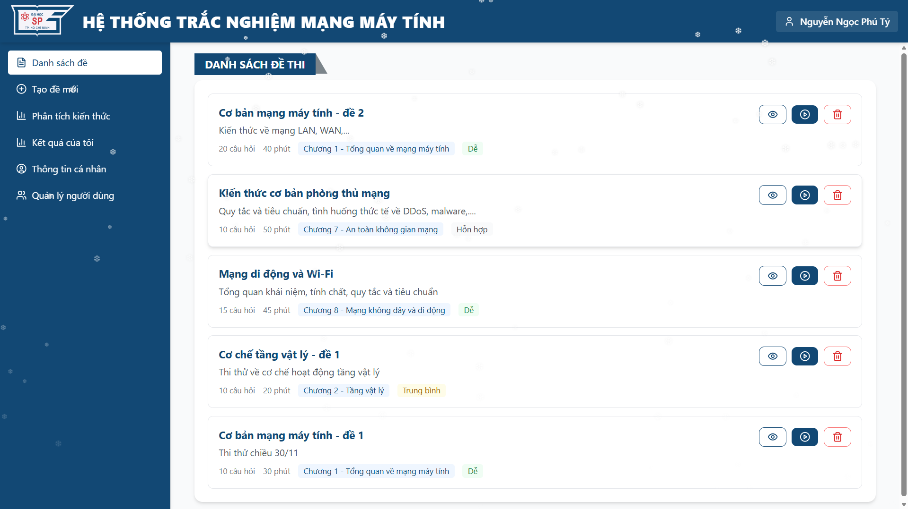

# Hệ thống trắc nghiệm môn Mạng Máy Tính

<p align="center">
  
</p>

Hệ thống tạo và quản lý đề thi trắc nghiệm cho môn học mạng máy tính, sử dụng AI để tạo câu hỏi, cho phép học sinh làm bài và phân tích kết quả.

## Tổng quan

Đây là một ứng dụng web full-stack được thiết kế để giúp sinh viên luyện tập và kiểm tra kiến thức về mạng máy tính. Hệ thống sử dụng Google Gemini AI để tạo câu hỏi dựa trên các chương và chủ đề của khóa học, đồng thời cung cấp phân tích và phản hồi chi tiết.

## Tính năng

### Cho sinh viên

- Làm bài thi với bộ đếm thời gian
- Xem kết quả bài thi và phản hồi chi tiết
- Phân tích hiệu suất bằng AI
- Theo dõi tiến độ theo thời gian
- Xem lịch sử bài thi cá nhân
- Quản lý hồ sơ cá nhân

### Cho quản trị viên

- Tạo và quản lý đề thi
- Chỉnh sửa và xóa câu hỏi
- Tạo câu hỏi bằng AI
- Quản lý tài khoản người dùng (tạo, xóa, khóa, mở khóa)
- Xem tất cả bài làm của người dùng
- Tìm kiếm và phân trang danh sách người dùng

### Chức năng chính

- Tạo câu hỏi bằng AI sử dụng Google Gemini
- Làm bài thi thời gian thực với bộ đếm ngược
- Tính điểm tự động và kết quả
- Phân tích chi tiết bài làm với đáp án đúng/sai
- Phân tích loại kiến thức (khái niệm, thuộc tính, cơ chế, quy tắc, tình huống, ví dụ)
- Lọc câu hỏi theo chương và chủ đề
- Chọn mức độ khó (dễ, trung bình, khó)
- Thông báo toast cho phản hồi người dùng
- Thiết kế responsive

## Công nghệ sử dụng

### Frontend (Client)

- React 18.3.1
- TypeScript 5.5.3
- Vite 5.4.2
- Tailwind CSS 3.4.1
- Lucide React (Icons)

### Backend (Server)

- FastAPI
- Python 3.8+
- MongoDB (PyMongo)
- Google Gemini AI
- JWT Authentication
- Bcrypt password hashing

## Cấu trúc dự án

```
networking-quiz-generator/
├── client/                 # Ứng dụng React frontend
│   ├── src/
│   │   ├── components/     # Các component React
│   │   ├── contexts/       # React Context providers
│   │   ├── services/       # API services
│   │   └── types/          # Định nghĩa TypeScript types
│   └── README.md
├── server/                 # Ứng dụng FastAPI backend
│   ├── main.py            # FastAPI app và endpoints
│   ├── auth.py            # Các hàm xác thực
│   ├── database.py        # Kết nối database
│   ├── dtos.py            # Pydantic models
│   └── README.md
└── README.md              # File này
```

## Bắt đầu

Xem hướng dẫn cài đặt chi tiết trong:
- [`client/README.md`](client/README.md) - Hướng dẫn cài đặt và chạy frontend
- [`server/README.md`](server/README.md) - Hướng dẫn cài đặt và chạy backend

## Tài khoản Admin mặc định

Khi khởi động lần đầu, một tài khoản admin sẽ được tạo tự động:
- Email: `admin@example.com` (có thể cấu hình qua `ADMIN_EMAIL`)
- Mật khẩu: `admin123` (có thể cấu hình qua `ADMIN_PASSWORD`)

## Tài liệu API

Khi server đang chạy, tài liệu API có sẵn tại:
- Swagger UI: `http://localhost:8000/docs`
- ReDoc: `http://localhost:8000/redoc`

## Nội dung môn học

Hệ thống hỗ trợ 8 chương về mạng máy tính:

- Chương 1 - Tổng quan về mạng máy tính
- Chương 2 - Tầng vật lý
- Chương 3 - Tầng liên kết dữ liệu
- Chương 4 - Tầng mạng
- Chương 5 - Tầng giao vận
- Chương 6 - Tầng ứng dụng
- Chương 7 - An toàn không gian mạng
- Chương 8 - Mạng không dây và di động

Mỗi chương chứa nhiều chủ đề và hỗ trợ các loại kiến thức và mức độ khó khác nhau.

## Phát triển

### Frontend

Xem [`client/README.md`](client/README.md) để biết hướng dẫn phát triển frontend.

### Backend

Xem [`server/README.md`](server/README.md) để biết hướng dẫn phát triển backend.

## Giấy phép

Dự án này được cấp phép theo Giấy phép MIT. Xem tệp [LICENSE](LICENSE) để biết chi tiết.